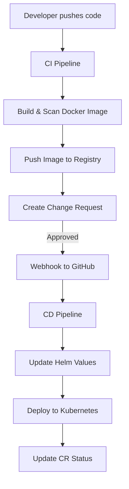

# PRUDENTIAL-CI/CD Pipeline Documentation

This document explains how our **CI/CD process** works for Prudential Project.

---

## CI Pipeline (Continuous Integration)

The CI pipeline runs whenever new code is pushed or a pull request is created.

### Steps:

1. **Checkout Code** – Gets the latest code from GitHub.
2. **Build Docker Image** – Creates a Docker image of the application.
3. **Run Security Scan** – Scans the Docker image with *Trivy* for vulnerabilities.
4. **Push Image** – Pushes the image to Docker Hub Registry.
5. **Create Change Request (CR)** – Sends details (commit, image, scan results, branch) to the Service Now ticketing system. The CR status is set to **PENDING**.

---

## CD Pipeline (Continuous Deployment)

The CD pipeline is triggered **automatically** when a Change Request is approved. The Service Now sends a **webhook** request to GitHub to start the deployment workflow.

### Steps:

1. **Webhook Trigger** – When CR is approved, the ticketing system calls GitHub’s workflow.
2. **Fetch CR Details** – Pipeline fetches the image and branch info from the CR.
3. **Checkout Helm Charts** – Pulls the Helm repo to prepare for deployment.
4. **Update Image in Helm Values** – Updates the image repo and tag in `values.yaml`.
5. **Deploy to Kubernetes** – Uses Helm to deploy or upgrade the app in the cluster.
6. **Update CR Status** – Sends back status (e.g., `DEPLOYED`) to the ticketing system.

---

## 🔄 Flow Diagram

---

